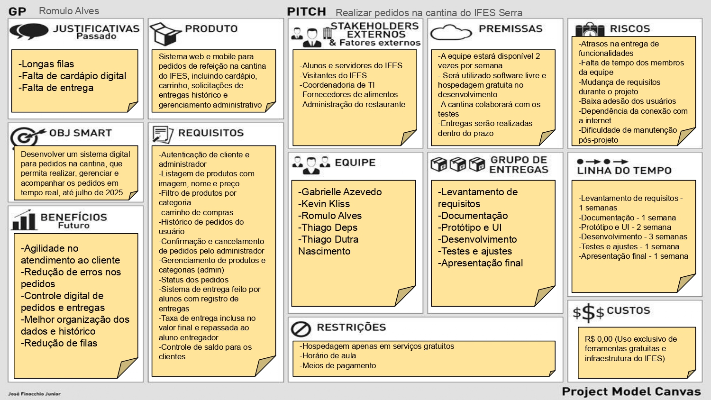
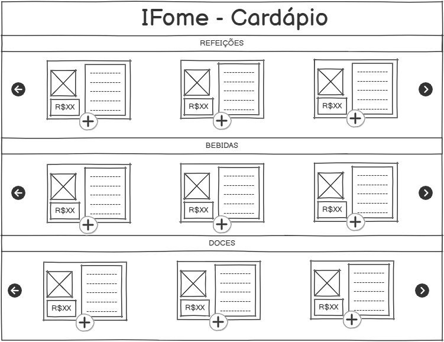
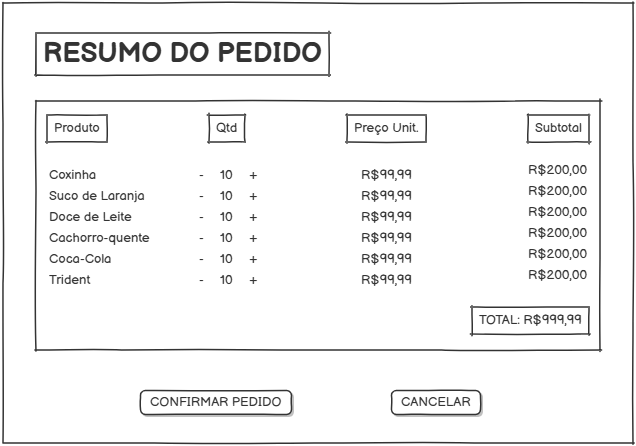
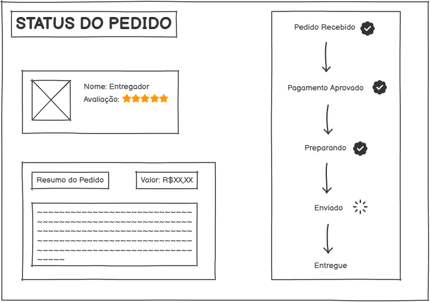
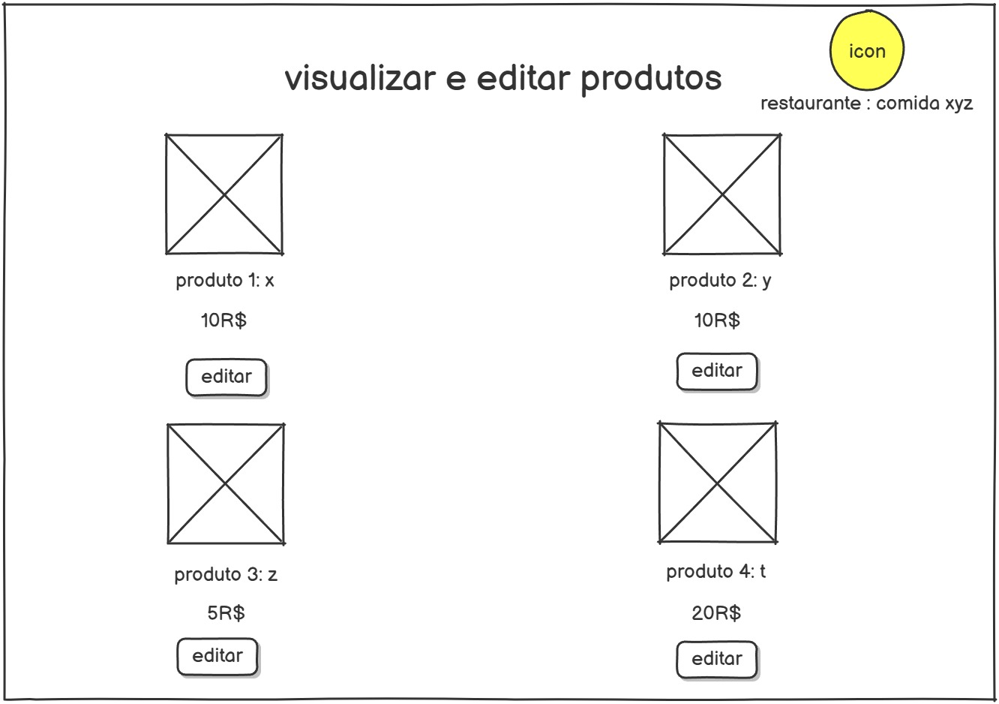

# 📘 Documentação do Projeto - Desenvolvimento Web

---

## 🧾 Visão Geral

O “IFome – Cantina Virtual do IFES” é um sistema web que tem como objetivo digitalizar o processo de pedidos da cantina do campus. A plataforma permitirá aos alunos:

      1. Visualizar um cardápio digital atualizado
      2. Realizar pedidos e pagamentos online
      3. Acompanhar o status do pedido e receber entrega na sala de aula
      4. Participar como entregador, ganhando o valor da taxa de entrega como crédito no sistema

---

## ✅ Backlog

______________________________________________________________________________________________________________________________________________
|  ID   | Prioridade |                                     História de Usuário                                                               |
|-------|------------|-----------------------------------------------------------------------------------------------------------------------|
| HU-1  |    1️⃣      | No papel de cliente, desejo visualizar uma lista de produtos com imagem e preço, para escolher o que quero pedir.    |
| HU-2  |    2️⃣      | No papel de cliente, desejo remover itens já selecionados do meu pedido.                                             |
| HU-3  |    3️⃣      | No papel de cliente, desejo visualizar o resumo do meu pedido com totais, para confirmar antes de finalizar.         |
| HU-4  |    4️⃣      | No papel de cliente, desejo finalizar meu pedido com um clique, para tornar o processo mais rápido.                  |
| HU-5  |    5️⃣      | No papel de cliente, desejo acompanhar o status do meu pedido, para saber quando será entregue.                      |
| HU-6  |    6️⃣      | No papel de cliente, desejo avaliar o pedido após a entrega, para ajudar outros usuários com feedbacks.              |
| HU-7  |    7️⃣      | No papel de cliente, desejo visualizar pedidos de entrega, para saber o que posso entregar.                          |
| HU-8  |    8️⃣      | No papel de cliente, desejo me cadastrar e fazer login, para ter um perfil com meus dados e pedidos anteriores.      |
| HU-9  |    9️⃣      | No papel de administrador, desejo confirmar um pedido, para autorizar o início da preparação e garantir que ele será atendido. 
| HU-10 |    🔟      | No papel de administrador, desejo editar produtos, para corrigir ou atualizar informações.                           |

---

## 🎨 Protótipo de Telas

Cada funcionalidade descrita no backlog possui ao menos uma tela representando sua interface esperada.

### 🖼️ Protótipo do Requisito HU-1

.

**Figura 1**: Tela de listagem de produtos com imagem, nome, preço e dispositivo para adicionar itens ao pedido.

### 🖼️ Protótipo do Requisito HU-3

.

**Figura 3**: Tela para visualizar o valor total do pedido e permitir, também, incrementar ou decrementar a quantidade do produto adicionado ao pedido.

### 🖼️ Protótipo do Requisito HU-5

.

**Figura 5**: Tela para visualizar o status do pedido, o perfil do entregador encarregado e a descrição do pedido.

### 🖼️ Protótipo do Requisito HU-6

.

**Figura 6**: Tela para avaliar o entregador e os produtos consumidos - é possível avaliar através da classificação por estrelas e comentando na caixa de texo. 

### 🖼️ Protótipo do Requisito HU-7

.

**Figura 7**: Tela para visualizar os pedidos disponíveis para entrega.

### 🖼️ Protótipo do Requisito HU-8

.

**Figura 8.1**: Tela para realizar login.

.

**Figura 8.2**: Tela para realizar cadastro de um novo usuário.

.

**Figura 8.3**: Tela para visualizar pedidos realizados e dados pessoais.

### 🖼️ Protótipo do Requisito HU-9

.

**Figura 9**: Tela para realizar aceite ou não novos pedidos.

### 🖼️ Protótipo do Requisito HU-10

.

**Figura 10**: Tela para realizar atualizão de produtos.

---

## 🏗 Análise e Projeto 

O projeto  do sistema 

### Modelo 

### Esboço da arquitetura geral (cliente-servidor)

### Autorização  e Autenticação 
A autorização no Strapi (a partir do v4 e mantida no v5) é baseada em perfis de usuários (roles) e permissões atribuídas a esses perfis. Ela define o que cada usuário pode ou não pode fazer ao interagir com os endpoints da API.

1. Tipos de usuários
O Strapi tem dois contextos principais de usuários:

🔹 Usuários Autenticados
Criados via cadastro/login na API pública.

Associados a uma role do tipo “Authenticated” ou outra personalizada.

Usam token JWT para acesso autenticado.

🔸 Usuários Administrativos
Criados via painel de administração do Strapi.

Usam o Strapi Admin Panel.

Gerenciados separadamente e com permissões diferentes.

### Tecnologias a serem utilizadas 
Strapi, HTML, CSS, SQLITE....

---

### Telas do sistema

**Figura 2**: Tela de listagem de produtos com imagem, nome e preço — correspondente à história de usuário HU-1.

